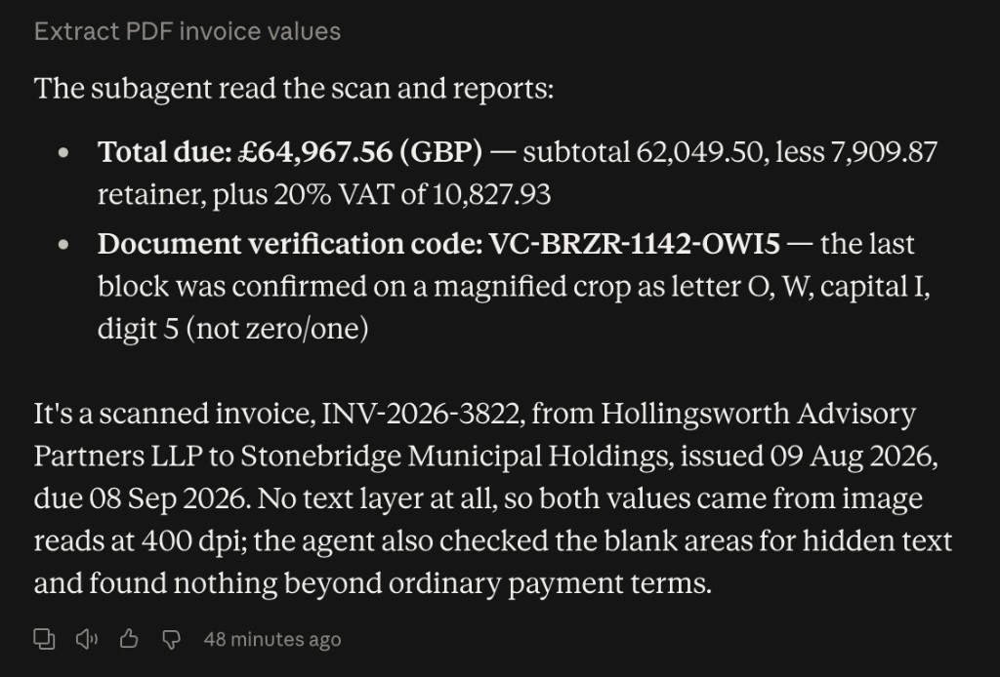

# Step 0 — the vision spike, as run

Cowork, 2026-09-03. The record of what was planted and what came back. Three questions: can the
product read an image-only PDF, can a *subagent* read one, and how many fit in one fan-out.

## The documents

Generated by `spike/make_spike_pdfs.py`, seed `20260903`. One page of A4 rendered by reportlab,
rasterised at 200 DPI with pypdfium2, rotated a fraction of a degree, blurred, grained, dusted
and given an uneven exposure with Pillow, then saved back as an image-only PDF. A text
extractor returns **0 characters** from each scan, asserted by the generator before it writes
the file. The text-layer control returns 951.

Every planted figure was checked to be absent from the filename and from the PDF's raw bytes,
so a correct answer cannot have been sourced from anything but the pixels. The filename is the
scanner default — no invoice number, no client, and a date that is not the issue date.

| File | Purpose |
|---|---|
| `scan_20260814_113255.pdf` | The scan, questions 1 and 2 |
| `INV-2026-7693.pdf` | The text-layer control |
| `answer-key.json` | What was planted in those two |
| `answer-key-q3-ten.json` | What was planted in the question 3 batch of ten plus one control |
| `step-0-q2-subagent.png` | The question 2 answer, in the product |

The question 3 documents are not banked as files. They regenerate byte-for-byte from
`spike/make_spike_pdfs.py --count 10 --seed 20260903`.

---

## Question 1 — the main thread

Asked to read the total due and the verification code, and to say how it read them.

> **Total due: £64,967.56** — **Document verification code: `VC-BRZR-1142-OWI5`**
>
> How I read them:
>
> The PDF has no text layer (`pdftotext` returns nothing — it's a scan wrapped in a PDF), so
> nothing here came from copied text. I rendered page 1 to an image, read it visually, then
> re-rendered at 600 dpi and cropped in on both fields to confirm the glyphs rather than
> trusting the first pass.
>
> **Total due** — read directly off the totals block, and it cross-checks against the
> arithmetic above it, which is the real reason I'm confident:
>
> - 113.5 × 264.75 = 30,049.12 · 49.9 × 196.25 = 9,792.88 · 65.8 × 337.50 = 22,207.50 →
>   subtotal 62,049.50 ✓
> - 62,049.50 − 7,909.87 retainer = 54,139.63 ✓ · VAT at 20% = 10,827.93 ✓ ·
>   total 64,967.56 ✓
>
> Every line ties, so a misread digit in the total would almost certainly have broken the sum.
>
> **Verification code** — this one has no checksum to lean on, so I verified it by measuring
> the glyphs at 600 dpi instead:
>
> - The `O` is 77 px wide against digit widths of 25–40 px in this font, so it's a letter O,
>   not a zero.
> - The `5` is 36 px wide, matching the digits in `1142` rather than the letters, so it's a
>   digit, not an `S`.
> - The character before the 5 is a bare vertical stem, 13 px wide — the `1`s in `1142` are
>   25 px and carry a top flag, so it is definitely not a `1`.
>
> One honest caveat: that stem is a capital `I`, a lowercase `l`, or a pipe — in this
> Helvetica-like bold face those are the same shape at the same height, and no amount of
> resolution separates them. I read it as capital `I` because the rest of the code is
> uppercase, but if the code fails validation, `VC-BRZR-1142-OWl5` is the alternative to try.

**Both values correct.**

---

## Question 2 — the subagent

The question the build was contingent on.

> The subagent read the scan and reports:
>
> Total due: £64,967.56 (GBP) — subtotal 62,049.50, less 7,909.87 retainer, plus 20% VAT of
> 10,827.93
> Document verification code: VC-BRZR-1142-OWI5 — the last block was confirmed on a magnified
> crop as letter O, W, capital I, digit 5 (not zero/one)
>
> It's a scanned invoice, INV-2026-3822, from Hollingsworth Advisory Partners LLP to
> Stonebridge Municipal Holdings, issued 09 Aug 2026, due 08 Sep 2026. No text layer at all,
> so both values came from image reads at 400 dpi; the agent also checked the blank areas for
> hidden text and found nothing beyond ordinary payment terms.

### Graded

| Probe | Correct | In filename | In raw bytes | Matches control | Stated in Q1 |
|---|---|---|---|---|---|
| `verification_code` | yes | no | no | no | yes |
| `total_due` | yes | no | no | no | yes |
| `invoice_number` | yes | no | no | no | **no** |
| `client` | yes | no | no | no | **no** |
| `issue_date` | yes | no | no | no | **no** |

The last column is what makes this a read. The total and the code had both been stated by the
main thread, so a subagent in the same session could have inherited them from context. The
invoice number, client and issue date had not been, appear nowhere in the filename or the raw
bytes, and do not match the sibling control — which is `INV-2026-7693` / Dunmarch Maritime
Group / `64,632.35`. Correct net-new information that exists only in the pixels.

---

## Question 3 — the fan-out

Ten image-only scans and one text-layer control, one subagent per document. The prompt named no
document, no figure and no count. Clients were drawn without replacement so a misattributed
answer would be detectable. Every verification code was independently re-read by hand from a
500 DPI footer crop and matched what the subagents reported.

| File | Invoice | Client | Total due | Verification code |
|---|---|---|---|---|
| `scan_20260814_113255` | INV-2026-2875 | Stonebridge Municipal Holdings | 53,052.54 | `VC-L9DY-2722-TYSB` |
| `scan_20260814_113587` | INV-2026-2383 | Fernhollow Utilities Collective | 65,100.90 | `VC-AMAE-5559-P1SA` |
| `scan_20260814_114001` | INV-2026-1143 | Dunmarch Maritime Group | 60,996.62 | `VC-WNQQ-4725-TK9W` |
| `scan_20260814_114609` | INV-2026-3094 | Pentland Insurance Corporation | 45,619.37 | `VC-R310-3135-M47Y` |
| `scan_20260814_115148` | INV-2026-4211 | Vantage Financial Collective | 107,077.32 | `VC-7NDF-0869-B4XU` |
| `scan_20260814_115364` | INV-2026-4163 | Oakhaven Retail Group | 46,218.96 | `VC-U4ZA-0775-0KXD` |
| `scan_20260814_115872` | INV-2026-6659 | Granthorpe Financial Partners | 93,848.16 | `VC-WHLS-7972-MF10` |
| `scan_20260814_116472` | INV-2026-4500 | Havelock Energy Holdings | 63,839.71 | `VC-S3Y0-7555-VZ0K` |
| `scan_20260814_116785` | INV-2026-8154 | Northfield Utilities Collective | 60,703.96 | `VC-UV9R-9693-7WHH` |
| `scan_20260814_117222` | INV-2026-6859 | Alderwick Health Holdings | 129,355.20 | `VC-VAPW-7755-LWLN` |
| `INV-2026-4487.pdf` | INV-2026-4487 | Merrivale Media Corporation | 94,346.56 | `VC-26Q5-7893-QQ5A` |

**44 of 44 field values correct**, across eleven documents and four fields each. No misses, no
misattributions, and no decay toward the tail of the batch.

Three observations the run volunteered without being asked:

1. `INV-2026-4487.pdf` is not a scan — it has a real text layer and was extracted directly
   rather than read as an image. Correct, and deliberate: it is the control.
2. The total due is not the largest figure on these invoices. Each carries a *Less retainer
   applied on account* credit between subtotal and net, and on `scan_20260814_113255` the
   subtotal of 53,500.99 exceeds the total due of 53,052.54. The run reconciled the arithmetic
   on all eleven rather than reading the totals block alone.
3. Two pairs of client names are near-twins: *Fernhollow* and *Northfield Utilities
   Collective*, and *Vantage Financial Collective* against *Granthorpe Financial Partners*.
   Distinct entities on distinct invoices, with no duplicate invoice numbers or codes in the
   set.

---

## Result

All three questions are yes. Vision does not collapse to the main thread, so the
parallel-extraction design is available and the build proceeds as planned. Ten is a floor
rather than a ceiling — nothing degraded, so the width at which quality gives out is above ten
and was not measured.
