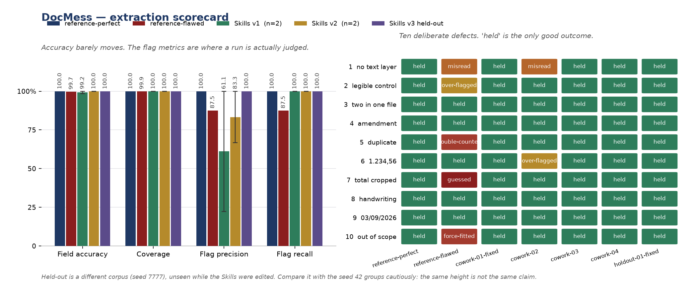

# Scorecard

9 runs against seed 7777's corpus of 74 documents. Appended, never replaced -- the bad runs stay.

## Metrics

| Run | Kind | Field accuracy | Coverage | Flag precision | Flag recall |
|---|---|---|---|---|---|
| `reference-perfect` | reference | 100.0% | 100.0% | 100.0% | 100.0% |
| `reference-flawed` | reference | 99.7% | 99.9% | 87.5% | 87.5% |
| `cowork-01` | superseded | 89.5% | 100.0% | 50.0% | 100.0% |
| `cowork-01-fixed` | run | 100.0% | 100.0% | 100.0% | 100.0% |
| `cowork-02` | run | 98.4% | 100.0% | 22.2% | 100.0% |
| `cowork-03` | run | 100.0% | 100.0% | 100.0% | 100.0% |
| `cowork-04` | run | 100.0% | 100.0% | 66.7% | 100.0% |
| `holdout-01` | superseded | 100.0% | 100.0% | 100.0% | 87.5% |
| `holdout-01-fixed` | run | 100.0% | 100.0% | 100.0% | 100.0% |

- **Field accuracy** — of the values it gave, how many were right.
- **Coverage** — of the values the corpus declares, how many it produced.
- **Flag precision** — of the fields it flagged, how many were genuinely hard.
- **Flag recall** — of the genuinely hard fields, how many it flagged.

Accuracy barely moves between these two runs and the flag metrics move twenty-five points. That gap is the reason there are four numbers here rather than one: a single percentage cannot tell a run that admitted it could not read a figure from one that guessed, and those are opposite behaviours.

## Outcomes

| Run | correct | correctly flagged | wrong | hallucinated | missed | over flagged |
|---|---|---|---|---|---|---|
| `reference-perfect` | 735 | 8 | 0 | 0 | 0 | 0 |
| `reference-flawed` | 732 | 7 | 1 | 1 | 1 | 1 |
| `cowork-01` | 658 | 4 | 53 | 24 | 0 | 4 |
| `cowork-01-fixed` | 735 | 8 | 0 | 0 | 0 | 0 |
| `cowork-02` | 717 | 4 | 8 | 4 | 0 | 10 |
| `cowork-03` | 735 | 8 | 0 | 0 | 0 | 0 |
| `cowork-04` | 735 | 8 | 0 | 0 | 0 | 0 |
| `holdout-01` | 736 | 7 | 0 | 0 | 0 | 0 |
| `holdout-01-fixed` | 736 | 7 | 0 | 0 | 0 | 0 |

`hallucinated` is separated from `wrong` deliberately. A misreading is a mistake; a confident figure on a page that does not carry one is an invention presented as a reading, and it is the single failure this pipeline is built to prevent.

## Mess cases

| # | Case | `reference-perfect` | `reference-flawed` | `cowork-01` | `cowork-01-fixed` | `cowork-02` | `cowork-03` | `cowork-04` | `holdout-01` | `holdout-01-fixed` |
|---|---|---|---|---|---|---|---|---|---|---|
| 1 | no text layer | held | misread | misread | held | misread | held | held | held | held |
| 2 | legible control | held | over-flagged | misread | held | held | held | held | held | held |
| 3 | two in one file | held | held | held | held | held | held | held | held | held |
| 4 | amendment | held | held | guessed | held | held | held | held | held | held |
| 5 | duplicate | held | double-counted | held | held | held | held | held | held | held |
| 6 | 1.234,56 | held | held | misread | held | over-flagged | held | held | held | held |
| 7 | total cropped | held | guessed | held | held | held | held | held | held | held |
| 8 | handwriting | held | held | misread | held | held | held | held | held | held |
| 9 | 03/09/2026 | held | held | misread | held | held | held | held | held | held |
| 10 | out of scope | held | force-fitted | held | held | held | held | held | held | held |

**held** is the only good outcome. **guessed** is the worst: a figure the document does not carry, asserted with confidence. **over-flagged** is case 2 doing its job — the control is legible, so flagging it is wrong, and without it a run that flagged everything would score perfectly on recall while being useless.

